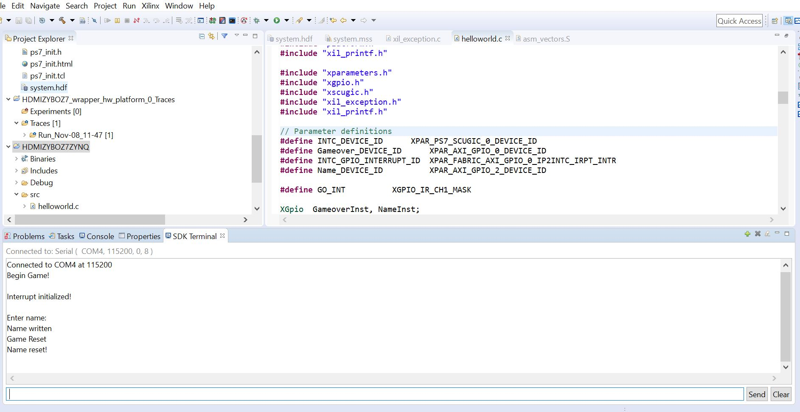

# HDMIBreakout
A ZYNQ 7020 project that plays breakout via HDMI. The programming logic communicates with the 
processing logic. 

 

# HDMIBreakout Supplies 
1. ZYBO ZYNQ 7020   
2. Sanwa Top Handle Arcade Joystick  
3. Breadboard  
4. Wire  
5. 5 10K resistors  
6. 3 16mm pushbuttons  
7. HDMI cable  

# HDMIBreakout Flowchart

# HDMIBreakout game flow 
1. Title Screen 

2. Game in Session 
 
3. Game Over (Name not entered)
 
4. SDK Terminal during Game Over (Interrupt activated)
 
5. SDK Terminal during Game Over (Name Written, exit out of handler)
 
6. Game Over (Name entered)
 
7. SDK terminal Game is reset (Reset is entered, Interrupt activated)
 

# HDMIBreakout Block Design 

Note: Block divid_generator_0 was taken from https://numato.com/kb/hdmi-output-example-design-using-vivado-for-mimas-a7-fpga-development-board/  
The original hdmi code is provided in folder mimasA7_hdmi_out https://github.com/SnrNotHere16/HDMIBreakout/tree/main/mimasA7_hdmi_out  
The code was modified to allow the game's vga input to display the game. 

# HDMIBreakout PinMapping 

# HDMIBreakout Video 
https://www.youtube.com/watch?v=NCKsvmawYa8&feature=youtu.be
